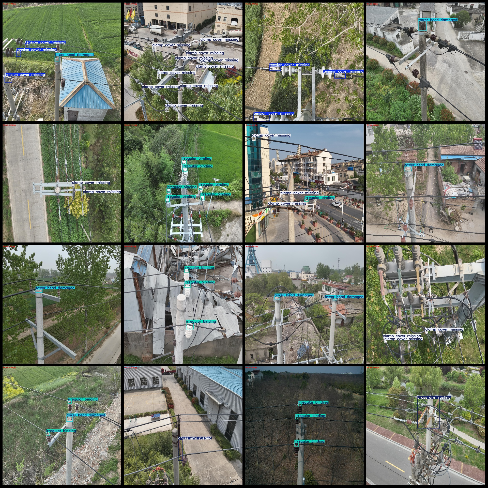
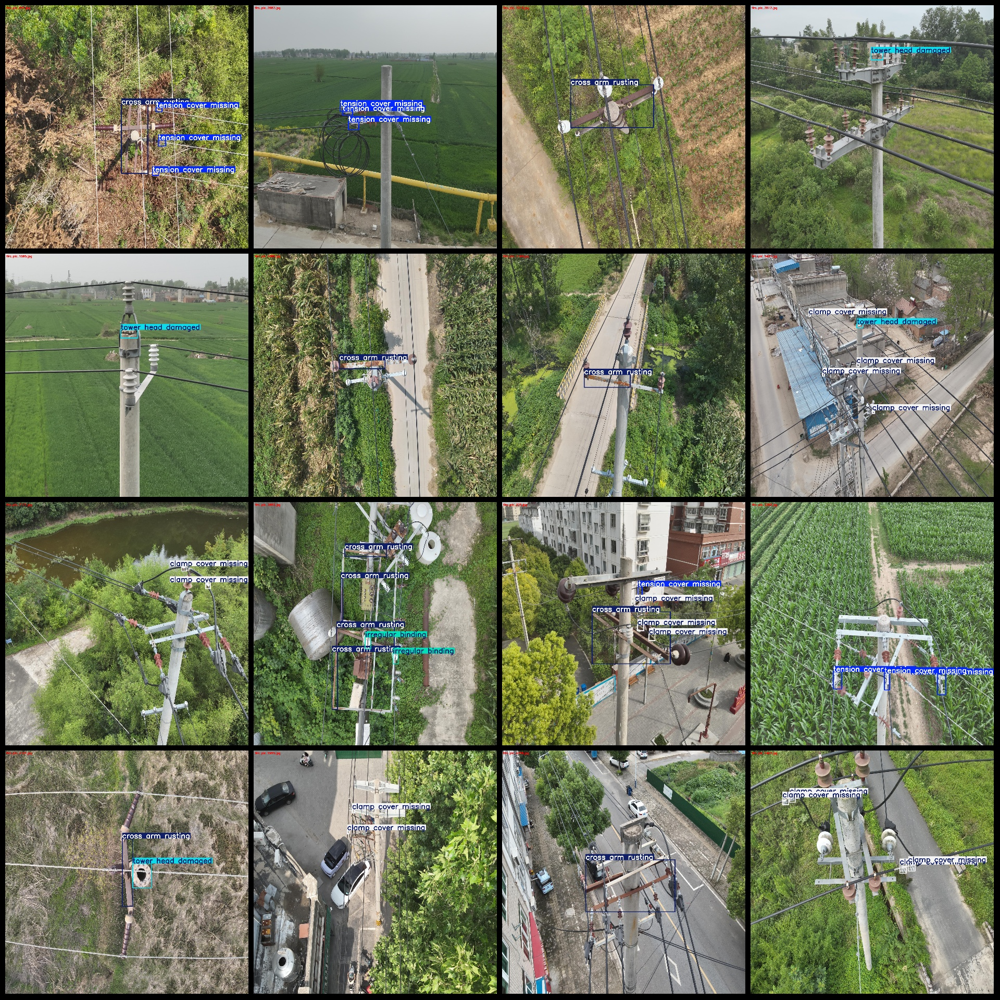

# High-resolution Power Scenes: Defect Detection in Power Transmission Line Pole Towers Dataset VOC+YOLO Format with 4481 Images of 5 Classes

The dataset format is Pascal VOC format + YOLO format (without the segmentation path in txtfile, only containing jpgimage and corresponding VOC format xmlfile and yolo format txtfile).
number of images: 4481  
annotation count: 4481  
annotation count: 4481  
annotationnumber of classes: 5  
Annotation class names: ["clamp cover missing", "cross arm rusting", "irregular binding", "tension cover missing", "tower head damaged"]
boxes per class:   
Missing clamp cover (missing box count = 4288)
Rust on cross arm (cross arm rusting, missing box count = 2085)
Irregular binding (irregular binding, missing box count = 3149)
Tension cover missing (missing box count = 4424)
Damaged tower head (missing box count = 1455)
total boxes: 15401  
images per class:   
Cover missing (Clamp Cover Missing), images = 1253
Rust of cross arm (Rust on Cross Arm), images = 1553
Irregular binding (Irregular Tensioning), images = 989
Tension cover missing (Tension Cover Missing), images = 1227
Damaged tower head (Damaged Tower Head), images = 1410
image resolution: 2048x2048  
Use an annotation tool: labelImg
Annotation rules: draw a rectangle box around the class
Important notes: The dataset does not have a division of training, validation, and test sets. You need to divide them yourself.
Special statement: This dataset does not guarantee the accuracy of the trained model or weight file.
Image preview:
## Images

Here is a pay link on Stripe ( https://buy.stripe.com/3cs8yP7sY87d0vu9AB ). Please contact me lonlonago@foxmail.com after funding $89, and I will send you a complete data files , thank you!

